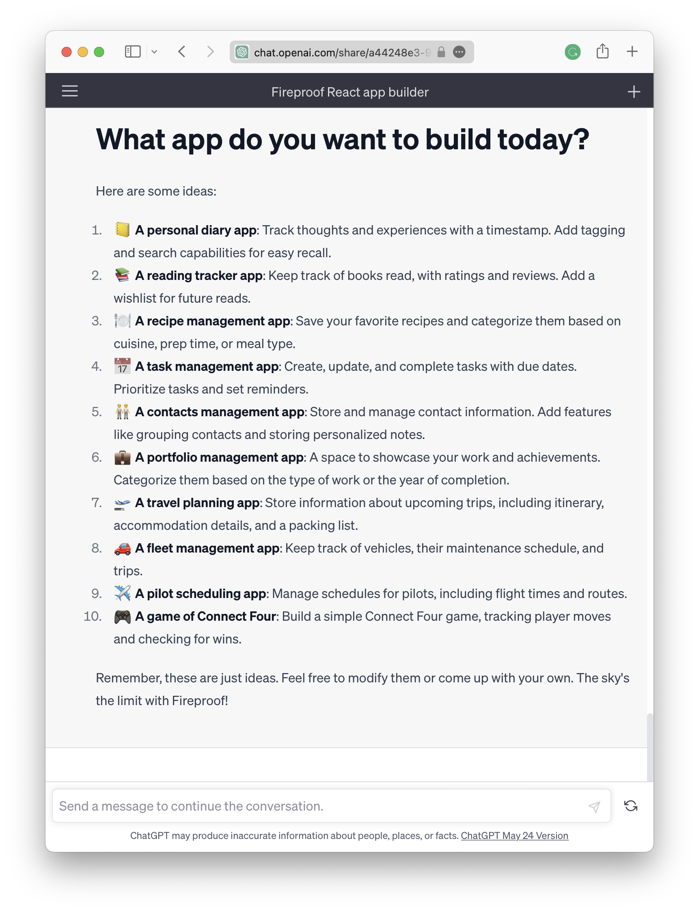

# ChatGPT Quick Start

Fireproof is explicitly designed to be useful without requiring any setup or configuration. This makes it especially easy for ChatGPT to use, because Fireproof apps don't need to have a lot of hidden logic outside of the React code. Keep reading for pointers on how to leverage ChatGPT when writing code that uses Fireproof.

## React App Builders

The ChatGPT shared conversations feature allows users to link to in-flight conversations. For programmers, this is great because you can train a conversation to be an expert in a particular library, and then re-use that expertise over and over. For example, you could train a conversation to be an expert in web performance, and then use that conversation to help assess web performance in any app. Similarly, we've created a handful of Fireproof "expert builders" that you can use to kick start your development. Start by choosing a CSS framework, and then click the link to start a conversation with that expert builder.

* [Ant Design](https://chat.openai.com/share/a44248e3-94cf-473f-81d7-dcc7450a8770)
* [@emotion/styled](https://chat.openai.com/share/11049ce5-684e-4dcf-8538-2729f090952d)
* [Tailwind CSS](https://chat.openai.com/share/f8b0899c-9783-40ca-b643-7d850bac33d2)

We encourage you to review the conversation history and learn how to create your own expert builders. If you create a new expert builder, please share it with us so we can add it to the list!