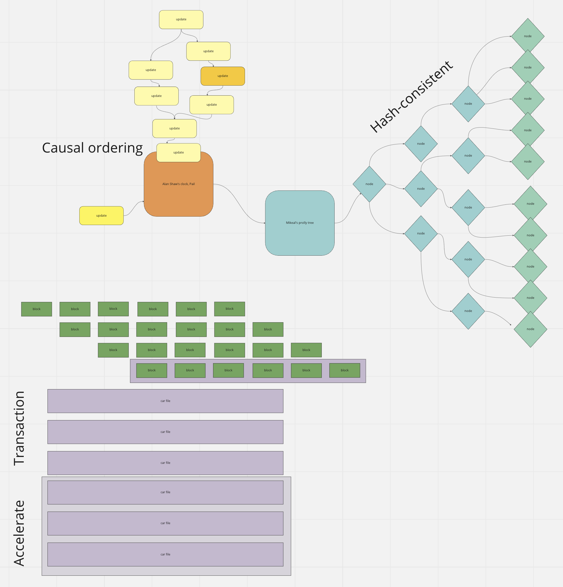

# Architecture

In this article, we will explore how Fireproof works as a decentralized realtime database, including how it handles document storage and lookup, event feeds, map-reduce, transactions, replication, encryption, and distributed authorization. If you prefer a video presentation of similar content, catch [my talk on the recent IPLD community call.](https://www.youtube.com/watch?v=IAystzwgemU)

### Document Storage and Lookup

Fireproof stores documents using prolly-trees, which are a type of B-Tree that allows for efficient replication as the data changes. This is because no matter what order of operations, the same data ends up with the same physical layout and same Merkle hash root, making sync cheap and fast. Each node in the tree contains a list of child nodes, which can be either leaf nodes or internal nodes. Leaf nodes contain the actual data, while internal nodes contain pointers to other nodes in the tree. To retrieve a specific document, Fireproof uses a unique content identifier (CID) that points to the root node of the prolly tree. Once the root node is retrieved, the system can traverse the tree to find the appropriate leaf node containing the desired document.

Fireproof uses a distributed approach for document storage and lookup. Update events are logged to [Pail, which is a Merkle clock causal event log](https://github.com/alanshaw/pail), similar to a write-ahead log in a regular database, but distributed. The clock log can be cheaply merged across any two actors or points in time, revealing any conflicting record updates that need to be reconciled. This allows offline and disconnected edits to be merged when they are received by other collaborators. The events are sorted by causal order and applied to a deterministic b-tree. Fireproof uses [Mikeal’s prolly-trees library](https://github.com/mikeal/prolly-trees), but is fundamentally compatible with any immutable storage system and optimized for any that use Merkle trees, especially deterministic Merkle trees. The essential property of these trees is that they resolve to the same root content identifier, no matter what order the updates are applied. This means that multiple users can replicate a dataset, but only the necessary changes need to go over the wire.

### Event Feed

The event feed in Fireproof allows users to get instant notifications of changes to their data, with real-time updates synced across all devices and apps. This is made possible through a combination of WebRTC and IPFS, providing fast and efficient real-time updates without the need for constant polling or manual refresh.

Under the hood, Fireproof uses MVCC (multi-version concurrency control) versioning and Merkle causal history tracking to ensure that users can always recover the desired version of their data, and query a stable snapshot of the ledger. Immutable data structures simplify replication and improve performance, while also enabling rollback to old data whenever needed. This provides peace of mind knowing that the data is secure and easily recoverable.

Merkle clocks and hash trees are used to provide lossless merging and immutable and self-validating data structures, making replicating changes safe and efficient. This makes Fireproof an ideal solution for smart contract and other trustless applications.

### Map Reduce

With Fireproof, you can access your JSON data from any app or website with a simple put, get, and delete interface. Embed, index, and organize files of any size using IPFS links. But Fireproof goes beyond just basic storage and retrieval, offering custom indexing capabilities through map-reduce functionality.

Fireproof indexes are defined by custom JavaScript functions that you write, allowing you to easily index and search your data in the way that works best for your application. Queries run locally, making Fireproof faster than any cloud database. With the ability to define indexes for any JSON data, you can handle data variety and schema drift by normalizing any data to the desired index.

Map-reduce functions are used to define indexes, making it easy to normalize data and simplify indexing and searching. This functionality allows you to handle data of any size, making it ideal for applications with big data requirements. And since queries are run locally, it allows for faster data processing and retrieval.

Overall, Fireproof's map-reduce capabilities allow for custom indexing and querying, making it a powerful tool for any application that requires efficient data processing and retrieval.

### Transactions

Fireproof uses the **Content Addressable aRchive** (CAR) format to handle updates to the ledger. CAR is a packaging format for content-addressed data that enables easy storage and transfer of large amounts of data. The data stored in CARs is defined by InterPlanetary Linked Data (IPLD), which is a specification and set of implementations for structured data types that can link to each other using a hash-based Content Identifier (CID). IPLD data forms a Directed Acyclic Graph (DAG), which enables powerful indexing and searching capabilities.

Clients can ship CAR transactions to other clients on the network. Each CAR transaction contains one or more IPFS blocks, each of which contains updates to the ledger. The CAR transaction also contains a unique content identifier (CID) that points to the root node of the updated ledger clock. Clients can validate the CAR transaction and apply the updates to their local copy of Fireproof.

Furthermore, Fireproof allows each ledger to be archived to a single CAR file, enabling high-performance page loads and other use cases where fast start is crucial. By leveraging IPLD-over-ObjectStores, Fireproof can function as an IPLD database with key-value stores, indexing, and a powerful query language that can handle privacy and access patterns. Object stores like S3, R2, or any cloud provider with compatible interfaces can be used to host Fireproof backends. By following some simple patterns, Fireproof enables the creation of a larger graph database that can travel like a graph itself, mutate into other states, filter out data, and combine data from different sources, with limitless options for storage and distribution, all enabled by efficient append-only hash-linked immutable data structures.

### Replication

Fireproof's replication mechanism is built on top of IPFS and HTTP, which enables the efficient and reliable replication of data across multiple nodes on the network. Each node on the network maintains its own copy of the ledger and its clock. When a new update is made to the ledger, a new CID is generated and added to the local clock. The CID is then broadcast to other nodes on the network, which validates the update and applies it to their local copy of the ledger.

This replication mechanism allows for replication targets to be any IPFS-compatible block store, such as web3.storage, or any Fireproof instance running in another browser or a cloud environment. In addition, Fireproof enables the archiving of ledgers to static asset servers, allowing for fast loading of game levels, web pages, and other content. By leveraging IPFS, Fireproof can replicate and distribute data across a decentralized network, ensuring data availability and reliability, even in the face of network disruptions or failures.

### Encryption

Fireproof supports end-to-end encryption of data to ensure that it remains secure while in transit and at rest. 

Fireproof uses end-to-end encryption of data at the block level with a shared symmetric secret key. Encrypted blocks are AES-GCM encrypted with either a 128-bit or 256-bit key. The shape of the encrypted graph cannot be easily determined since the links inside each block link to the unencrypted block addresses. Decryption of the entire proof is required before any read operations can be performed on the ledger. Users must be mindful not to leak unencrypted blocks and generate secure shared secrets for encryption. More advanced encryption workflows can be built on top of Fireproof’s default encryption, such as wrapping graphs in more than one layer of encryption to share a key with a data provider that can replicate data but not read it.

In addition to end-to-end encryption, Fireproof also supports advanced encryption workflows such as re-encryption of content for end users using smart contracts like [MedusaNet](https://medusanet.xyz/). This allows for secure sharing of data without having to share keys.

Real-time replication can also be achieved through the use of cleartext blocks sent over secure webRTC sessions. This means that each user maintains a private encrypted copy of the data while no users have to share anything beyond session encryption. This ensures that data remains secure even during real-time collaboration and sharing.

By providing robust encryption options and secure replication methods, Fireproof enables developers to build applications that can handle sensitive data with confidence.

### Distributed Authorization

Fireproof uses [UCAN cryptographic proofs](https://ucan.xyz) to handle distributed authorization. UCAN, or User Controlled Authorization Networks, is a novel approach to user identity and authorization that empowers end-users. It flips the traditional "service-controlled" notion of user identity and authorization around so that the user creates their own cryptographically secure identifier and shares it with the service. Using cryptographic keys for user identity helps solve the authentication problem, but there's still the matter of authorization or what the user is allowed to do. UCAN solves this problem by embedding permissions into a secure token that can be attached to a request to prove that the user is allowed to perform the requested action. The UCAN token also contains a proof chain that shows how the user's capabilities were issued and by whom. Delegation is another key feature of UCAN that allows users to share their access to a resource with other agents without actually needing to give them a copy of their private key. This is achieved by allowing users to freely delegate some or all of their capabilities to another agent by issuing their own UCAN tokens. The delegated UCANs have a proof chain with multiple links in the form of UCAN tokens, making it easy to control which agents can exercise the user's capabilities.