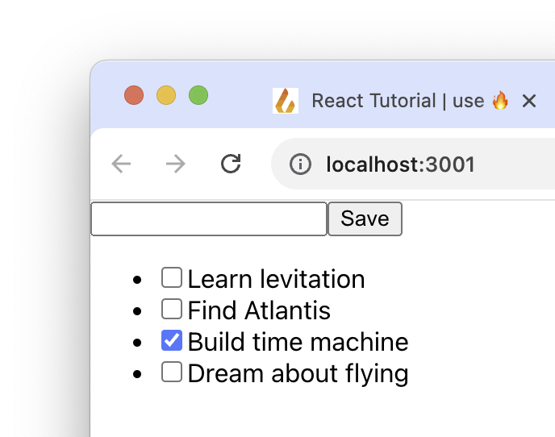

# React Tutorial

This article will walk you through creating a simple todo list application from scratch. If you are new to React, it should be all you need to get started. If you are an expert, skim ahead and then check out the [API docs](/docs/react-hooks/use-live-query).

*If you are starting a fresh project, you might want to fork [the Fireproof React Starter Kit](https://github.com/fireproof-storage/fireproof-starter-kit-react-ts-vite). It has routes, authentication, and a basic data model already built, so you'll have a winning app in no time.*

## Create a New App

We'll start with a fresh React app. We'll use Vite, but we've tested with Next.js and it works great. We need help with [Remix](https://github.com/fireproof-storage/fireproof/issues/1), and there's a [known workaround if you prefer Create React App](https://github.com/fireproof-storage/fireproof/issues/2). If you have a favorite React starter, make a note on that issue and we'll add it to the list.

```bash
npm create vite@latest my-vite-fp-tutorial
# ✔ Select a framework: › React
# ✔ Select a variant: › TypeScript
cd my-vite-fp-tutorial
```

This app will manage todos. There's no schema to set up -- you can use TypeScript to enforce schemas, see [the React TypeScript Starter Kit for examples](https://github.com/fireproof-storage/fireproof-starter-kit-react-ts-vite). Instead we just start with a query that returns nothing, and a form that writes the documents to the database. In plain JavaScript apps, you can subscribe your `redraw()` function to the database, or inspect the update stream and surgically update the parts of the page that need to change. In React, you don't have to worry about any of that, the hooks will do it for you.

### The Data Model

A todo document looks like this:

```js
{
  _id: '018ad289-efc6-7c93-acaa-202cf4b3cdb7',
  text: 'Learn Fireproof',
  completed: false,
  date: 1623937200000
}
```

The `_id` is automatically set by Fireproof so you can ignore it -- it comes in handy for uniqueness constraints, for instance you could set the `_id` equal to `todo.text` and then you'd never have two todos with the same text (but not be able to edit the text without creating a new document). The `date` field is used to sort the todos, and the `completed` field is used to toggle the checkbox.

More complex apps might have a `listId` on the todo, so you can group them into different lists. Then each list could be viewed independently.

## Install Fireproof

Installing the React hooks package will also install the [core Fireproof](https://www.npmjs.com/package/@fireproof/core) library. You don't need to run a server or install anything else, Fireproof includes connectors for S3 and IPFS.

```bash
npm install use-fireproof
```

## Connect Your Component

In this example, our todo list application can create todo items, list them, and toggle their completed status. We'll start by modifying the component called `App` in `src/App.tsx`. This component is wired as the root of the application by Vite in `src/main.tsx` so it's best to work within it. By the end of the tutorial we will have replaced the whole file, but take it one step at a time, to learn how the pieces fit together. The final file is shared below.

In this app, we use the top-level `useLiveQuery` hook to auto-refresh query responses (so your app dynamically refreshes with no extra work), and the `useDocument` hook to create new documents. These hooks can also be [configured by the optional `useFireproof` hook](/docs/react-hooks/use-fireproof), but most apps should start with the defaults.

### Import the Hooks

The first step is to import the hooks into your new app. In `src/App.js`, add the following line to the top of the file:

```js
import { useLiveQuery, useDocument } from 'use-fireproof'
```

These hooks are all you need to automatically initiate a browser-local copy of the database and begin development. The `useLiveQuery` hook will automatically refresh query results, and the `useDocument` hook loads and saves Fireproof documents and handles refreshing them when data changes.

Fireproof takes a build-first approach, so after your UI is running, you can connect to your cloud of choice. For now, let's build the app.

### Query Todos

Now, inside of your component, you can call `useLiveQuery` to get a list of todos (it will start empty):

```js
function App() {
  const response = useLiveQuery('date', {limit: 10, descending: true})
  const todos = response.docs
```

In short, this is indexing the database by the `date` field, and will ignore any documents that don't have a `date` field. Queries will be sorted by `date`. Learn more about queries in the [index and query documentation](/docs/database-api/index-query).

The `useLiveQuery` hook will automatically refresh the `response` object when the database changes. The response object contains the `docs` array, which is the list of todos. The response also has `rows` which are the index rows, in this case they will have a `key` with the `date` field of the todo, and an `id` field with the document id of the todo. In more complex applications you can customize the `value` of these rows, for instance to provide full-name from first and last. [Read more about indexes and queries in the documentation.](/docs/database-api/index-query)


In our application, the todos are displayed by the following JSX, which renders their `text` field. The event handler for updating the todo is written inline. Notice how `database.put` is used to toggle the `completed` field when the checkbox is clicked:

```jsx
<ul>
  {todos.map(todo => (
    <li key={todo._id}>
      <input
        type="checkbox"
        checked={todo.completed}
        onChange={() => useLiveQuery.database.put({ ...todo, completed: !todo.completed })}
      />
      {todo.text}
    </li>
  ))}
</ul>
```

For convenience, the `database` object is attached to the `useLiveQuery` and `useDocument` hooks. The `database.put` function is used to update the document, and it will automatically refresh the query results. Read more in the [document API documentation](/docs/database-api/documents). In this tutorial, we'll also use the `useDocument` hook to manage documents. The `database.put` function is better for toggling the completed field, but `useDocument` will be useful for creating new todos.

### Create a New Todo

Next, we'll add a form to create new todos. Notice how `useDocument` is called with an initial value for the document:

```js
const [todo, setTodo, saveTodo] = useDocument({ text: '', date: Date.now(), completed: false })
```

The return value is essentially the return value of [`useState`](https://react.dev/reference/react/useState) but with a save document function added, in this case called `saveTodo`. A very common pattern in React is to use a state variable and a setter function to manage the state of a form. This hook is a convenience for that pattern, but it also handles saving the document to the database. Follow the interactions in the code below to see how `useDocument` is compatible with the patterns you're already using with `useState`.

The `useDocument` hook is used to create a new document with an empty `text` field. The `saveTodo` function is called when the form is submitted, and it saves the document to the database. The `setTodo` function is used to update the `text` field as the user types. 

### Save the Todo

Here is the JSX that renders the form. The common React pattern described above is used here: the input field is bound to `todo.text`, `setTodo` is called with a new text field when the input changes, and `saveTodo` is called when the form is submitted, persisting the new todo to the database.

```jsx
<div>
  <input 
    type="text" 
    value={todo.text} 
    onChange={e => setTodo({ text: e.target.value })} 
  />
  <button
    onClick={() => {
      saveTodo()
      setTodo(false)
    }}
  >
    Save
  </button>
</div>
```
Another convenience detail: `setTodo` is called with `false` to clear the input field (and reset to the `useDocument` call's initial value) after the todo is saved. This is a common pattern in React, and it's handled automatically by the hook. In our current application, we want the document managed by `useDocument` to be a new one each time, so we do not specify an `_id` in the initial document value. If the initial document value had an `_id` field, the hook would update that document instead of creating a new one with each save. [Read more about the `useDocument` hook](/docs/react-hooks/use-document.md).

### Where's My Data?

By default, Fireproof stores data in the browser's local storage. This is great for development, but once your app is ready to share, you'll want to [connect it to cloud storage.](/docs/connect) For now, you can manage and delete the encrypted data from your browser developer tools. There are two components to the data, the header and the encrypted files. The header is kept in `localStorage` under the key `fp.useFireproof`. The files are stored in IndexedDB under the key `fp.<keyId>.useFireproof`. This arrangement means that files can be stored with an untrusted provider, and the header can be stored securely. For instance, you can keep the encrypted data files in IPFS or a public S3 bucket, and keep the headers locally or in your applications session store.

Once your data is replicated to the cloud, you can view and edit it with the Fireproof developer tools. (See the [Connect](/docs/connect) documentation for more information.)

## The Completed App

Here's the example to-do list that initializes the database and sets up automatic refresh for query results. The list of todos will redraw for all users in real-time. Replace the code in `src/App.js` with the following:

```jsx
import './App.css'
import { useLiveQuery, useDocument } from 'use-fireproof'

function App() {
  const response = useLiveQuery('date')
  const todos = response.docs
  const [todo, setTodo, saveTodo] = useDocument({ text: '', date: Date.now(), completed: false })

  return (
    <>
      <input
        title="text"
        type="text"
        value={todo.text as string}
        onChange={e => setTodo({ text: e.target.value })}
      />
      <button
        onClick={e => {
          e.preventDefault()
          saveTodo()
          setTodo(false)
        }}
      >
        Save
      </button>
      <ul>
        {todos.map(todo => (
          <li key={todo._id}>
            <input
              title="completed"
              type="checkbox"
              checked={todo.completed as boolean}
              onChange={() => useLiveQuery.database.put({ ...todo, completed: !todo.completed })}
            />
            {todo.text as string}
          </li>
        ))}
      </ul>
    </>
  )
}

export default App
```

## Run the App

Now take a look at your app. It will allow you to add items to the list and check the box.

```bash
npm run dev
```



You can clone [the resulting application here](https://github.com/jchris/my-vite-fp-tutorial).

## Learn More

*If you are starting a fresh project, you might want to fork [the Fireproof React Starter Kit](https://github.com/fireproof-storage/fireproof-starter-kit-react-ts-vite). It has routes, authentication, and a basic data model already built, so you can win a hackathon just by changing the parts you need.*

Continue reading about [how to integrate Fireproof with your existing authentication system](/), or check out the [ChatGPT quickstart](./chatgpt-quick-start) to learn how to use ChatGPT to rapidly prototype new applications with Fireproof.